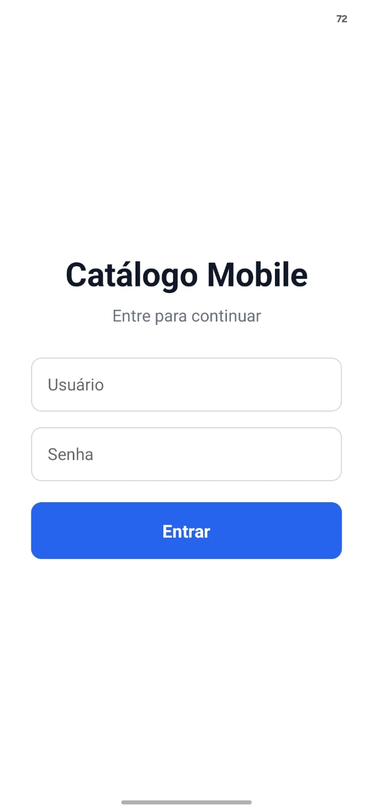
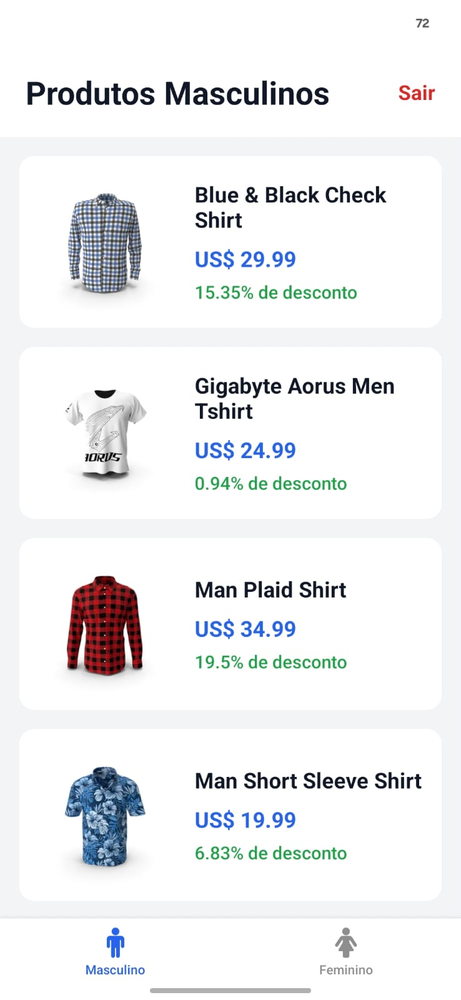
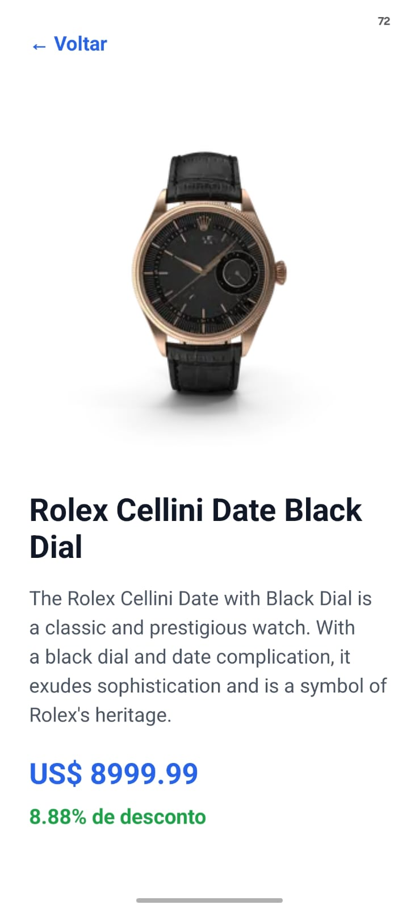

# Catálogo Interativo Mobile

Projeto desenvolvido para a disciplina de Mobile Development.

O aplicativo consiste em um catálogo mobile de produtos, desenvolvido com React Native e Expo. Os produtos são consumidos da API DummyJSON e organizados em categorias masculinas e femininas.

## Funcionalidades

- Tela de login com validação de campos
- Armazenamento temporário do usuário com Redux Toolkit
- Listagem de produtos masculinos e femininos
- Navegação por abas
- Consumo de API REST com Axios
- Tratamento de carregamento e erros
- Tela de detalhes dos produtos
- Exibição de imagem, nome, descrição, preço e desconto
- Logout com retorno para a tela de login

## Tecnologias utilizadas

- React Native
- Expo
- TypeScript
- Expo Router
- Axios
- Redux Toolkit
- React Redux
- DummyJSON API

## API utilizada

Os dados dos produtos são obtidos através da API DummyJSON.

Categorias masculinas:

- mens-shirts
- mens-shoes
- mens-watches

Categorias femininas:

- womens-bags
- womens-dresses
- womens-jewellery
- womens-shoes
- womens-watches

## Como executar o projeto

Clone o repositório:

```bash
git clone https://github.com/GustaLDK/catalogo-interativo-mobile.git
```

Entre na pasta:

```bash
cd catalogo-interativo-mobile
```

Instale as dependências:

```bash
npm install
```

Execute o projeto:

```bash
npx expo start
```

## Screenshots

### Login



### Produtos Masculinos



### Produtos Femininos


### Detalhes do Produto



## Autor

Gustavo Gonçalves

Projeto acadêmico desenvolvido para a disciplina de Mobile Development.

git clone https://github.com/GustaLDK/catalogo-interativo-mobile.git